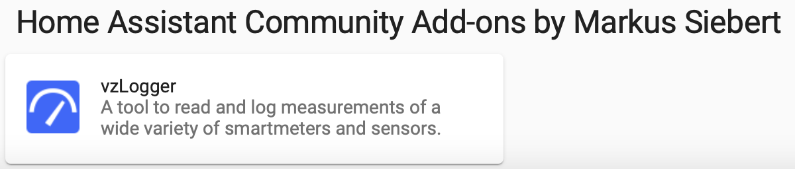

<!-- markdownlint-disable-file MD013 -->
# Welcome to the Home Assistant Addon project for vzlogger 👋

> ⚠️ **Clarification:** I am not the author of the great vzlogger software. 
> Please visit [the vzlogger GitHub Repository](https://wiki.volkszaehler.org/software/controller/vzlogger) for more information.

This Repository contains the dockerimage of the Home Assistant Addon for vzlogger. The addon was created to offer an easy to use way to integrate vzlogger to your Home Assistant setup, as it's the most powerfull metering tool I know at the moment.

This docker image is based on the a[addon-debian-base image](https://github.com/hassio-addons/addon-debian-base)

### 🏠 [Homepage of vzlogger](https://wiki.volkszaehler.org/software/controller/vzlogger)

### 🏠 [Homepage of Home Assistant](https://www.home-assistant.io/)

## Usage

1. Add the [Home Assistant Community Addons by Markus Siebert](https://github.com/markussiebert/home-assistant-addons) repository.  
   Follow the [Installing third-party add-ons](https://www.home-assistant.io/common-tasks/os/#installing-third-party-add-ons) guide.  
   Now you should see the addon in the Add-on-Store:  
   
2. Install the Addon
3. Follow the [DOCS](DOCS.md) to configure your vzlogger installation.

## Author

👤 **Markus Siebert**

- Website: info.markussiebert.com
- Twitter: [@msiebert_com](https://twitter.com/msiebert_com)
- Github: [@markussiebert](https://github.com/markussiebert)

## 🤝 Contributing

Contributions, issues and feature requests are welcome! Feel free to check [issues page](https://github.com/markussiebert/homeassistant-addon-vzlogger/issues).

## Show your support

Give a ⭐️ if this project helped you!

## 📝 License

Copyright © 2021 [Markus Siebert](https://github.com/markussiebert). 
This project is [GNU GENERAL PUBLIC LICENSE Version 3](https://github.com/markussiebert/homeassistant-addon-vzlogger/blob/main/LICENSE) licensed.

---

_This README was generated with ❤️ by [readme-md-generator](https://github.com/kefranabg/readme-md-generator)_
